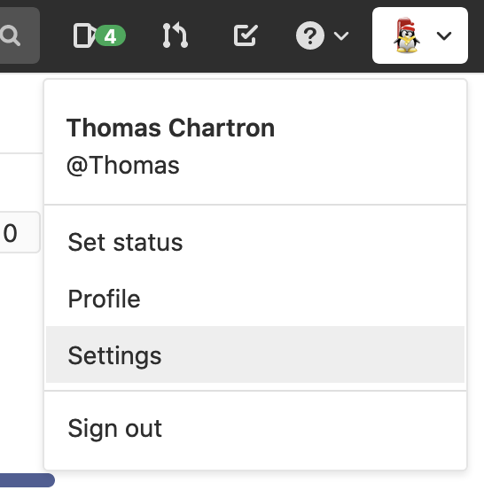
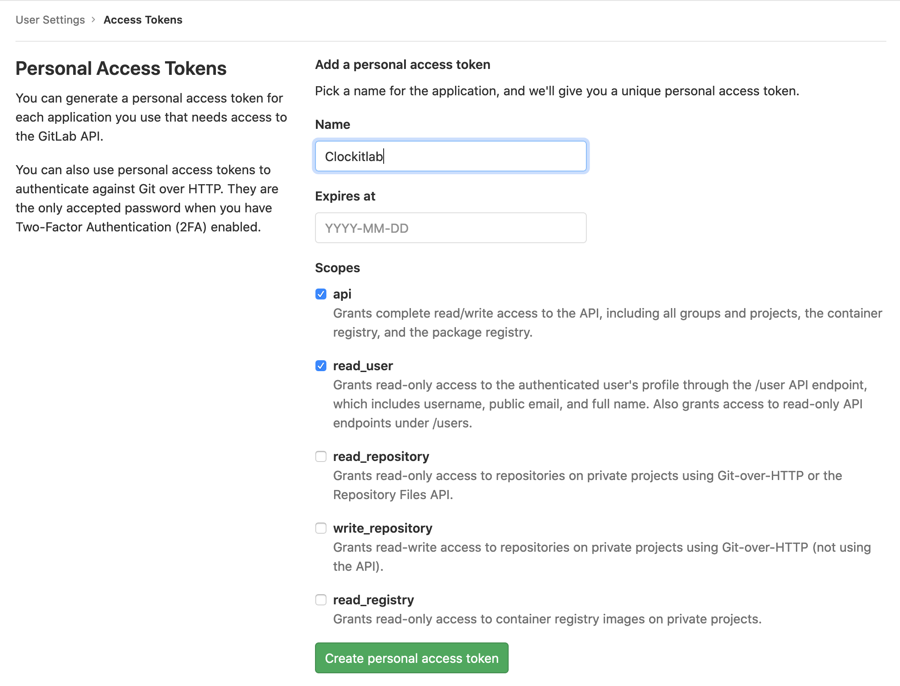
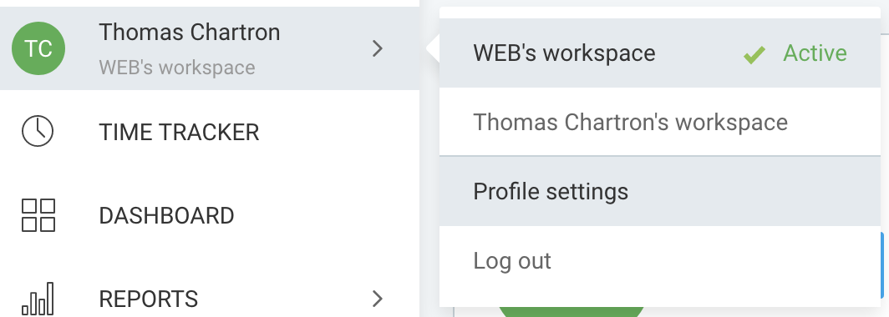
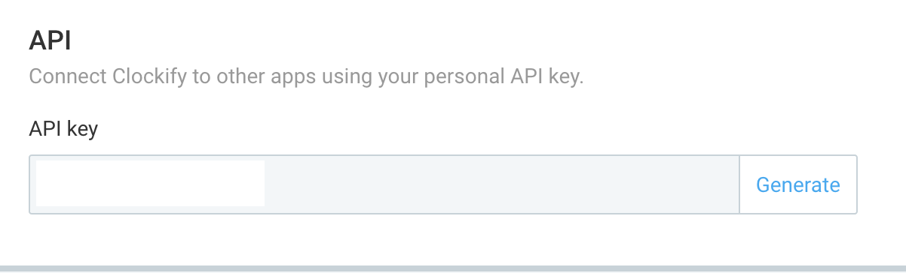
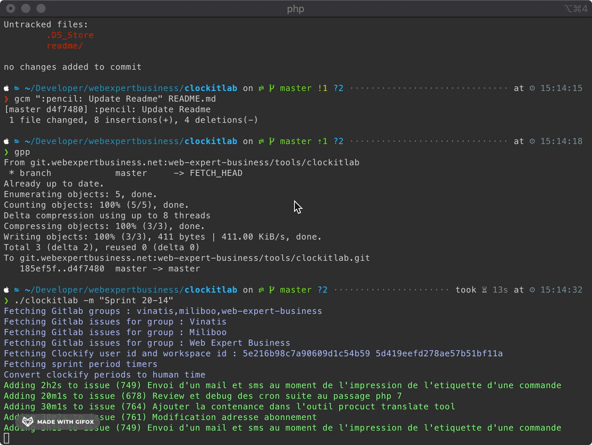

# Clockitlab

Clockitlab récupère les timers de Clockify en fonction des dates de la milestone demandée et ajoute les temps correspondants sur les issues Gitlab.

## Pré-requis

* PHP 7.3+
* Composer
* Gitlab Api token
* Clockify Api token

### Installation

```
git clone git@git.webexpertbusiness.net:web-expert-business/tools/clockitlab.git
cd clockitlab
cp .env.example .env
composer install
chmod u+x clockitlab
```

## Configuration
### Gitlab Api Token
___
  
  
  
### Clockify Api Token  
___
  
  

## Utilisation
Add spent times
```
#PHP
./clockitlab -m "Sprint 20-14"
#DOCKER
docker container run --rm -v $(pwd):/clockitlab/ php:7.4-cli /bin/bash -c "curl -sS https://getcomposer.org/installer | php -- --install-dir=/usr/local/bin --filename=composer; cd clockitlab; /usr/local/bin/composer install; chmod u+x /clockitlab/clockitlab; php /clockitlab/clockitlab -m 'Sprint 20-14';"
```
Reset spent times
```
#PHP
./clockitlab -m "Sprint 20-14" -r
#DOCKER
docker container run --rm -v $(pwd):/clockitlab/ php:7.4-cli /bin/bash -c "curl -sS https://getcomposer.org/installer | php -- --install-dir=/usr/local/bin --filename=composer; cd clockitlab; /usr/local/bin/composer install; chmod u+x /clockitlab/clockitlab; php /clockitlab/clockitlab -m 'Sprint 20-14' -r;"
```

  


* **Web Expert Business** - [Web Expert Business](https://git.webexpertbusiness.net)
